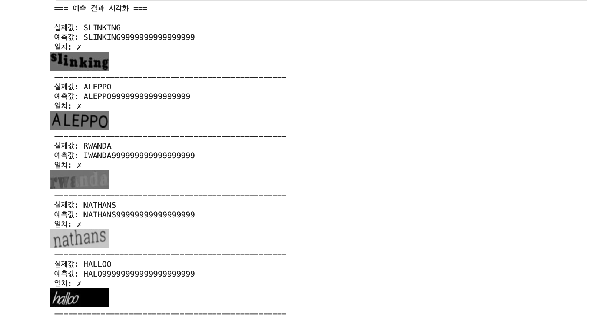
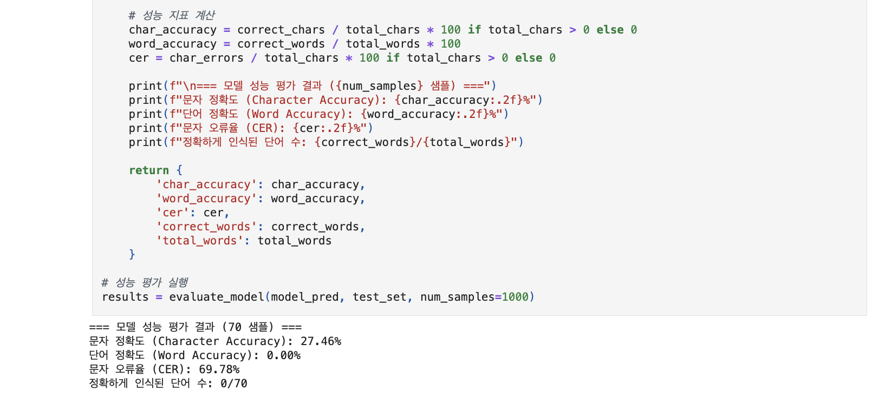
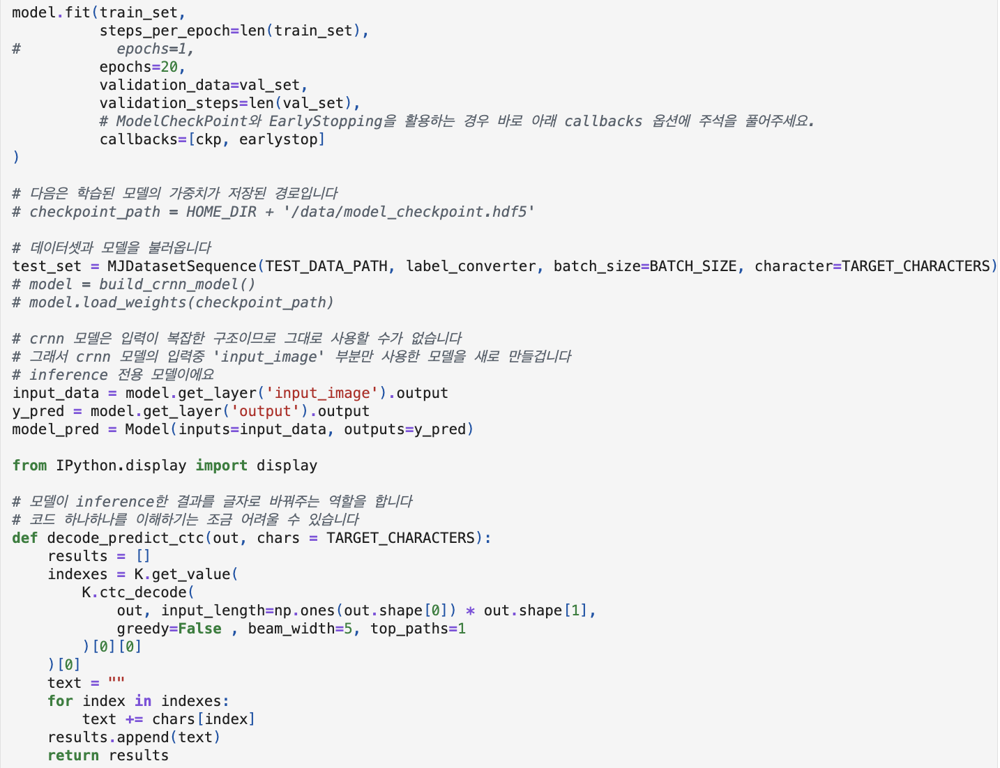
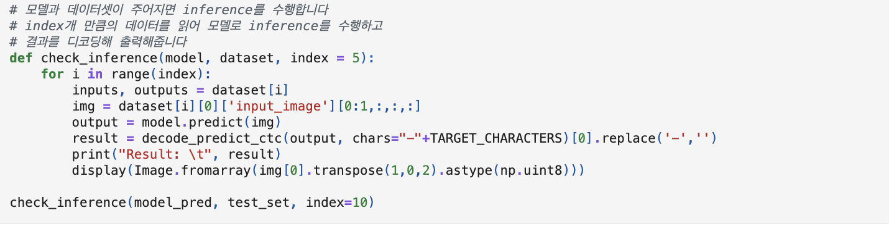
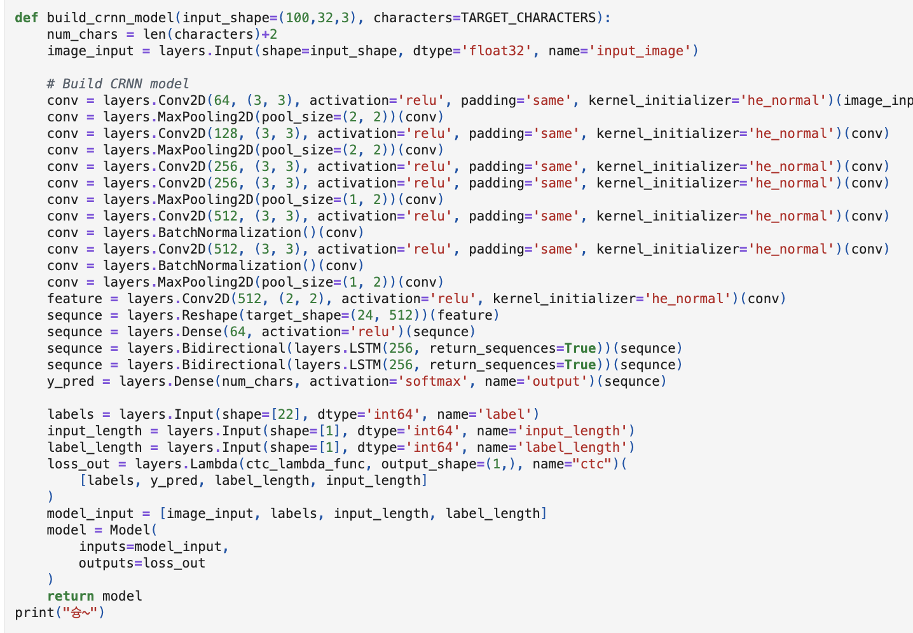
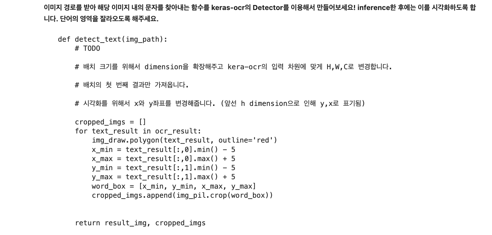
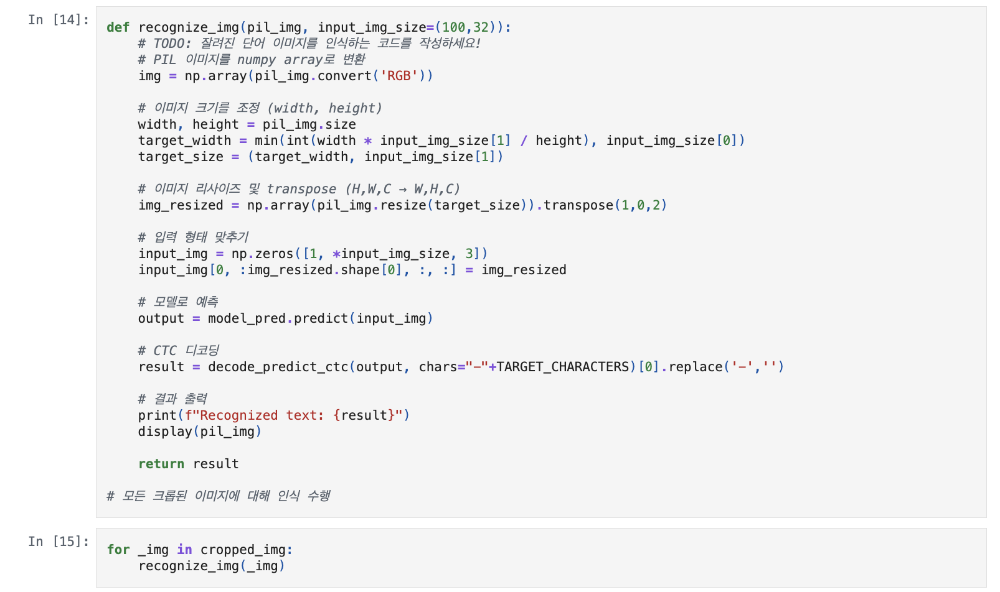
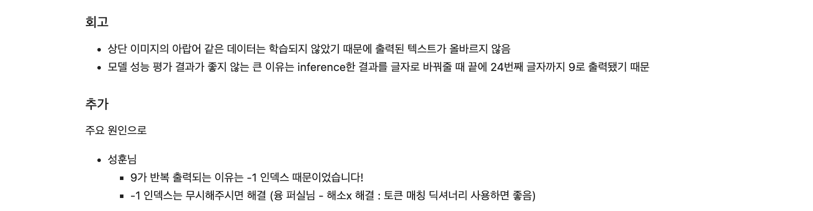

# AIFFEL Campus Online Code Peer Review Templete
- 코더 : 김지환.
- 리뷰어 : 신기성.


# PRT(Peer Review Template)
- [o]  **1. 주어진 문제를 해결하는 완성된 코드가 제출되었나요?**
    - 네, 문제에서 요구하는 최종 결과물이 첨부되었습니다. 
        
    
- [o]  **2. 전체 코드에서 가장 핵심적이거나 가장 복잡하고 이해하기 어려운 부분에 작성된 
주석 또는 doc string을 보고 해당 코드가 잘 이해되었나요?**
    - 해당 코드 블럭이 핵심적이라 생각한 이유는, 모델을 학습 시키고 학습 목표를 달성 하는데 핵심적인 구조이기 때문입니다. 
    - 해당 코드 블럭에 doc string/annotation이 모델 구조를 만드는 crnn에는 달려 있지는 않았지만, 모델 구조자체를 이해하는데는 문제가 없었으며, 그 이외에 모델 구조를 해석하고 분석하는 과정에 있어서는 doc string/annotation이 설명이 되어 있어서 오히려 조금 더 자세하게 내용의 흐름을 이해 할 수 있었던 것 같습니다. 
    - 네, 해당 코드의 기능, 존재 이유, 작동 원리 등을 같이 기술하였습니다. 또한 주석을 보고 코드 이해에 도움이 되었습니다. 
        
        
        
        
        
- [o]  **3. 에러가 난 부분을 디버깅하여 문제를 해결한 기록을 남겼거나
새로운 시도 또는 추가 실험을 수행해봤나요?**
    - 네, 문제 원인 및 해결 과정을 잘 기록하였는지 확인
    - 네, 프로젝트 평가 기준에 더해 추가적으로 수행한 나만의 시도, 
    실험이 기록되어 있는지 확인
        
        
        
        
- [o]  **4. 회고를 잘 작성했나요?**
    - 회고가 짧고 간결하게 적혀 있어서 간단명료 해서 좋았지만, 앞에서 말한것 처럼 조금더 
    주어진 문제를 해결하는 완성된 코드 내지 프로젝트 결과물에 대해 배운점과 아쉬운점, 느낀점 등을 상세하게 
    기록 해주면 더 좋을 거 같습니다. 하지만, 전체 코드 실행 플로우를 자신만의 방식으로 시도하려는 
    모습들이 확실히 보였고, 자시만의 방법으로 시도하고 이해하려는 모습과 함께 독자가 이해할 수 있게끔 하는 방식이 좋았습니다. 
        
        
- [o]  **5. 코드가 간결하고 효율적인가요?**
    - 네, 파이썬 스타일 가이드 (PEP8) 를 준수하였고, 코드 중복을 최소화하고 범용적으로 사용할 수 있도록 함수화 및 모듈화를 하였습니다.
        
        
        


# 회고(참고 링크 및 코드 개선)
```
리뷰어의 회고를 작성합니다.
코드 리뷰를 진행하면서, 코더가 많은 고민을 하고 자신만의 방식으로 시도 하려는 의도가 보였고, 이해하려고 하는 방식이 보였습니다. 
```
